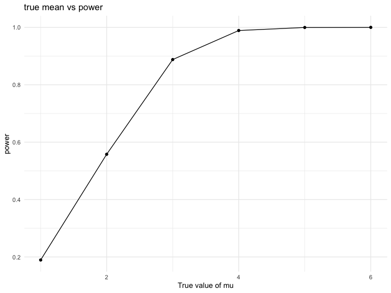

p8105_hw5_jy3270
================
Jingya Yu
2022-11-16

## Problem 1(provided by professor)

The code chunk below imports the data in individual spreadsheets
contained in `./data/zip_data/`. To do this, I create a dataframe that
includes the list of all files in that directory and the complete path
to each file. As a next step, I `map` over paths and import data using
the `read_csv` function. Finally, I `unnest` the result of `map`.

``` r
full_df = 
  tibble(
    files = list.files("data/zip_data/"),
    path = str_c("data/zip_data/", files)
  ) %>% 
  mutate(data = map(path, read_csv)) %>% 
  unnest()
```

    ## Rows: 1 Columns: 8
    ## ── Column specification ────────────────────────────────────────────────────────
    ## Delimiter: ","
    ## dbl (8): week_1, week_2, week_3, week_4, week_5, week_6, week_7, week_8
    ## 
    ## ℹ Use `spec()` to retrieve the full column specification for this data.
    ## ℹ Specify the column types or set `show_col_types = FALSE` to quiet this message.
    ## Rows: 1 Columns: 8
    ## ── Column specification ────────────────────────────────────────────────────────
    ## Delimiter: ","
    ## dbl (8): week_1, week_2, week_3, week_4, week_5, week_6, week_7, week_8
    ## 
    ## ℹ Use `spec()` to retrieve the full column specification for this data.
    ## ℹ Specify the column types or set `show_col_types = FALSE` to quiet this message.
    ## Rows: 1 Columns: 8
    ## ── Column specification ────────────────────────────────────────────────────────
    ## Delimiter: ","
    ## dbl (8): week_1, week_2, week_3, week_4, week_5, week_6, week_7, week_8
    ## 
    ## ℹ Use `spec()` to retrieve the full column specification for this data.
    ## ℹ Specify the column types or set `show_col_types = FALSE` to quiet this message.
    ## Rows: 1 Columns: 8
    ## ── Column specification ────────────────────────────────────────────────────────
    ## Delimiter: ","
    ## dbl (8): week_1, week_2, week_3, week_4, week_5, week_6, week_7, week_8
    ## 
    ## ℹ Use `spec()` to retrieve the full column specification for this data.
    ## ℹ Specify the column types or set `show_col_types = FALSE` to quiet this message.
    ## Rows: 1 Columns: 8
    ## ── Column specification ────────────────────────────────────────────────────────
    ## Delimiter: ","
    ## dbl (8): week_1, week_2, week_3, week_4, week_5, week_6, week_7, week_8
    ## 
    ## ℹ Use `spec()` to retrieve the full column specification for this data.
    ## ℹ Specify the column types or set `show_col_types = FALSE` to quiet this message.
    ## Rows: 1 Columns: 8
    ## ── Column specification ────────────────────────────────────────────────────────
    ## Delimiter: ","
    ## dbl (8): week_1, week_2, week_3, week_4, week_5, week_6, week_7, week_8
    ## 
    ## ℹ Use `spec()` to retrieve the full column specification for this data.
    ## ℹ Specify the column types or set `show_col_types = FALSE` to quiet this message.
    ## Rows: 1 Columns: 8
    ## ── Column specification ────────────────────────────────────────────────────────
    ## Delimiter: ","
    ## dbl (8): week_1, week_2, week_3, week_4, week_5, week_6, week_7, week_8
    ## 
    ## ℹ Use `spec()` to retrieve the full column specification for this data.
    ## ℹ Specify the column types or set `show_col_types = FALSE` to quiet this message.
    ## Rows: 1 Columns: 8
    ## ── Column specification ────────────────────────────────────────────────────────
    ## Delimiter: ","
    ## dbl (8): week_1, week_2, week_3, week_4, week_5, week_6, week_7, week_8
    ## 
    ## ℹ Use `spec()` to retrieve the full column specification for this data.
    ## ℹ Specify the column types or set `show_col_types = FALSE` to quiet this message.
    ## Rows: 1 Columns: 8
    ## ── Column specification ────────────────────────────────────────────────────────
    ## Delimiter: ","
    ## dbl (8): week_1, week_2, week_3, week_4, week_5, week_6, week_7, week_8
    ## 
    ## ℹ Use `spec()` to retrieve the full column specification for this data.
    ## ℹ Specify the column types or set `show_col_types = FALSE` to quiet this message.
    ## Rows: 1 Columns: 8
    ## ── Column specification ────────────────────────────────────────────────────────
    ## Delimiter: ","
    ## dbl (8): week_1, week_2, week_3, week_4, week_5, week_6, week_7, week_8
    ## 
    ## ℹ Use `spec()` to retrieve the full column specification for this data.
    ## ℹ Specify the column types or set `show_col_types = FALSE` to quiet this message.
    ## Rows: 1 Columns: 8
    ## ── Column specification ────────────────────────────────────────────────────────
    ## Delimiter: ","
    ## dbl (8): week_1, week_2, week_3, week_4, week_5, week_6, week_7, week_8
    ## 
    ## ℹ Use `spec()` to retrieve the full column specification for this data.
    ## ℹ Specify the column types or set `show_col_types = FALSE` to quiet this message.
    ## Rows: 1 Columns: 8
    ## ── Column specification ────────────────────────────────────────────────────────
    ## Delimiter: ","
    ## dbl (8): week_1, week_2, week_3, week_4, week_5, week_6, week_7, week_8
    ## 
    ## ℹ Use `spec()` to retrieve the full column specification for this data.
    ## ℹ Specify the column types or set `show_col_types = FALSE` to quiet this message.
    ## Rows: 1 Columns: 8
    ## ── Column specification ────────────────────────────────────────────────────────
    ## Delimiter: ","
    ## dbl (8): week_1, week_2, week_3, week_4, week_5, week_6, week_7, week_8
    ## 
    ## ℹ Use `spec()` to retrieve the full column specification for this data.
    ## ℹ Specify the column types or set `show_col_types = FALSE` to quiet this message.
    ## Rows: 1 Columns: 8
    ## ── Column specification ────────────────────────────────────────────────────────
    ## Delimiter: ","
    ## dbl (8): week_1, week_2, week_3, week_4, week_5, week_6, week_7, week_8
    ## 
    ## ℹ Use `spec()` to retrieve the full column specification for this data.
    ## ℹ Specify the column types or set `show_col_types = FALSE` to quiet this message.
    ## Rows: 1 Columns: 8
    ## ── Column specification ────────────────────────────────────────────────────────
    ## Delimiter: ","
    ## dbl (8): week_1, week_2, week_3, week_4, week_5, week_6, week_7, week_8
    ## 
    ## ℹ Use `spec()` to retrieve the full column specification for this data.
    ## ℹ Specify the column types or set `show_col_types = FALSE` to quiet this message.
    ## Rows: 1 Columns: 8
    ## ── Column specification ────────────────────────────────────────────────────────
    ## Delimiter: ","
    ## dbl (8): week_1, week_2, week_3, week_4, week_5, week_6, week_7, week_8
    ## 
    ## ℹ Use `spec()` to retrieve the full column specification for this data.
    ## ℹ Specify the column types or set `show_col_types = FALSE` to quiet this message.
    ## Rows: 1 Columns: 8
    ## ── Column specification ────────────────────────────────────────────────────────
    ## Delimiter: ","
    ## dbl (8): week_1, week_2, week_3, week_4, week_5, week_6, week_7, week_8
    ## 
    ## ℹ Use `spec()` to retrieve the full column specification for this data.
    ## ℹ Specify the column types or set `show_col_types = FALSE` to quiet this message.
    ## Rows: 1 Columns: 8
    ## ── Column specification ────────────────────────────────────────────────────────
    ## Delimiter: ","
    ## dbl (8): week_1, week_2, week_3, week_4, week_5, week_6, week_7, week_8
    ## 
    ## ℹ Use `spec()` to retrieve the full column specification for this data.
    ## ℹ Specify the column types or set `show_col_types = FALSE` to quiet this message.
    ## Rows: 1 Columns: 8
    ## ── Column specification ────────────────────────────────────────────────────────
    ## Delimiter: ","
    ## dbl (8): week_1, week_2, week_3, week_4, week_5, week_6, week_7, week_8
    ## 
    ## ℹ Use `spec()` to retrieve the full column specification for this data.
    ## ℹ Specify the column types or set `show_col_types = FALSE` to quiet this message.
    ## Rows: 1 Columns: 8
    ## ── Column specification ────────────────────────────────────────────────────────
    ## Delimiter: ","
    ## dbl (8): week_1, week_2, week_3, week_4, week_5, week_6, week_7, week_8
    ## 
    ## ℹ Use `spec()` to retrieve the full column specification for this data.
    ## ℹ Specify the column types or set `show_col_types = FALSE` to quiet this message.

The result of the previous code chunk isn’t tidy – data are wide rather
than long, and some important variables are included as parts of others.
The code chunk below tides the data using string manipulations on the
file, converting from wide to long, and selecting relevant variables.

``` r
tidy_df = 
  full_df %>% 
  mutate(
    files = str_replace(files, ".csv", ""),
    group = str_sub(files, 1, 3)) %>% 
  pivot_longer(
    week_1:week_8,
    names_to = "week",
    values_to = "outcome",
    names_prefix = "week_") %>% 
  mutate(week = as.numeric(week)) %>% 
  select(group, subj = files, week, outcome)
```

Finally, the code chunk below creates a plot showing individual data,
faceted by group.

``` r
tidy_df %>% 
  ggplot(aes(x = week, y = outcome, group = subj, color = group)) + 
  geom_point() + 
  geom_path() + 
  facet_grid(~group)
```


This plot suggests high within-subject correlation – subjects who start
above average end up above average, and those that start below average
end up below average. Subjects in the control group generally don’t
change over time, but those in the experiment group increase their
outcome in a roughly linear way.

## Problem 2

``` r
homicide <- read_csv("https://raw.githubusercontent.com/washingtonpost/data-homicides/master/homicide-data.csv")
```

    ## Rows: 52179 Columns: 12
    ## ── Column specification ────────────────────────────────────────────────────────
    ## Delimiter: ","
    ## chr (9): uid, victim_last, victim_first, victim_race, victim_age, victim_sex...
    ## dbl (3): reported_date, lat, lon
    ## 
    ## ℹ Use `spec()` to retrieve the full column specification for this data.
    ## ℹ Specify the column types or set `show_col_types = FALSE` to quiet this message.

``` r
head(homicide)
```

    ## # A tibble: 6 × 12
    ##   uid    repor…¹ victi…² victi…³ victi…⁴ victi…⁵ victi…⁶ city  state   lat   lon
    ##   <chr>    <dbl> <chr>   <chr>   <chr>   <chr>   <chr>   <chr> <chr> <dbl> <dbl>
    ## 1 Alb-0…  2.01e7 GARCIA  JUAN    Hispan… 78      Male    Albu… NM     35.1 -107.
    ## 2 Alb-0…  2.01e7 MONTOYA CAMERON Hispan… 17      Male    Albu… NM     35.1 -107.
    ## 3 Alb-0…  2.01e7 SATTER… VIVIANA White   15      Female  Albu… NM     35.1 -107.
    ## 4 Alb-0…  2.01e7 MENDIO… CARLOS  Hispan… 32      Male    Albu… NM     35.1 -107.
    ## 5 Alb-0…  2.01e7 MULA    VIVIAN  White   72      Female  Albu… NM     35.1 -107.
    ## 6 Alb-0…  2.01e7 BOOK    GERALD… White   91      Female  Albu… NM     35.2 -107.
    ## # … with 1 more variable: disposition <chr>, and abbreviated variable names
    ## #   ¹​reported_date, ²​victim_last, ³​victim_first, ⁴​victim_race, ⁵​victim_age,
    ## #   ⁶​victim_sex

The dataset has 52179 observations and 12 variables. Each observation is
a homicide case, along with the case number, reported date, victim’s
first and last names, race, age, and sex, the location of the case
(city, state, latitude, and longitude), and the disposition of the case.

-   create a city-state variable

``` r
homicide = homicide %>%
  mutate(city_state = str_c(city, state, sep = ", "))
head(homicide)
```

    ## # A tibble: 6 × 13
    ##   uid    repor…¹ victi…² victi…³ victi…⁴ victi…⁵ victi…⁶ city  state   lat   lon
    ##   <chr>    <dbl> <chr>   <chr>   <chr>   <chr>   <chr>   <chr> <chr> <dbl> <dbl>
    ## 1 Alb-0…  2.01e7 GARCIA  JUAN    Hispan… 78      Male    Albu… NM     35.1 -107.
    ## 2 Alb-0…  2.01e7 MONTOYA CAMERON Hispan… 17      Male    Albu… NM     35.1 -107.
    ## 3 Alb-0…  2.01e7 SATTER… VIVIANA White   15      Female  Albu… NM     35.1 -107.
    ## 4 Alb-0…  2.01e7 MENDIO… CARLOS  Hispan… 32      Male    Albu… NM     35.1 -107.
    ## 5 Alb-0…  2.01e7 MULA    VIVIAN  White   72      Female  Albu… NM     35.1 -107.
    ## 6 Alb-0…  2.01e7 BOOK    GERALD… White   91      Female  Albu… NM     35.2 -107.
    ## # … with 2 more variables: disposition <chr>, city_state <chr>, and abbreviated
    ## #   variable names ¹​reported_date, ²​victim_last, ³​victim_first, ⁴​victim_race,
    ## #   ⁵​victim_age, ⁶​victim_sex

Summarize within cities to get the total count of homicides and the
total count of unsolved homicides.

``` r
summary = homicide %>%
  group_by(city_state) %>%
  summarize(total_count = n(),
            unsolved_cases = sum(disposition %in% c("Closed without arrest", "Open/No arrest"))) %>% 
 filter(city_state != "Tulsa, AL") 
summary
```

    ## # A tibble: 50 × 3
    ##    city_state      total_count unsolved_cases
    ##    <chr>                 <int>          <int>
    ##  1 Albuquerque, NM         378            146
    ##  2 Atlanta, GA             973            373
    ##  3 Baltimore, MD          2827           1825
    ##  4 Baton Rouge, LA         424            196
    ##  5 Birmingham, AL          800            347
    ##  6 Boston, MA              614            310
    ##  7 Buffalo, NY             521            319
    ##  8 Charlotte, NC           687            206
    ##  9 Chicago, IL            5535           4073
    ## 10 Cincinnati, OH          694            309
    ## # … with 40 more rows

For the city of Baltimore, MD. We use the prop.test function to estimate
the proportion of homicides that are unsolved

``` r
baltimore = summary %>%
  filter(city_state == "Baltimore, MD") 
  
baltimore_proptest = prop.test(baltimore$unsolved_cases, baltimore$total_count) %>% 
  broom::tidy() %>%
  select(estimate, conf.low, conf.high) 
baltimore_proptest
```

    ## # A tibble: 1 × 3
    ##   estimate conf.low conf.high
    ##      <dbl>    <dbl>     <dbl>
    ## 1    0.646    0.628     0.663

For all the cities

``` r
city_proptests = 
  purrr::map2_df(.x = summary$unsolved_cases,
            .y = summary$total_count,
            ~broom::tidy(prop.test(.x, .y))) %>%
  select(estimate, conf.low, conf.high) %>%
  mutate(city_state = summary$city_state) %>%
  relocate(city_state)
city_proptests
```

    ## # A tibble: 50 × 4
    ##    city_state      estimate conf.low conf.high
    ##    <chr>              <dbl>    <dbl>     <dbl>
    ##  1 Albuquerque, NM    0.386    0.337     0.438
    ##  2 Atlanta, GA        0.383    0.353     0.415
    ##  3 Baltimore, MD      0.646    0.628     0.663
    ##  4 Baton Rouge, LA    0.462    0.414     0.511
    ##  5 Birmingham, AL     0.434    0.399     0.469
    ##  6 Boston, MA         0.505    0.465     0.545
    ##  7 Buffalo, NY        0.612    0.569     0.654
    ##  8 Charlotte, NC      0.300    0.266     0.336
    ##  9 Chicago, IL        0.736    0.724     0.747
    ## 10 Cincinnati, OH     0.445    0.408     0.483
    ## # … with 40 more rows

Create a plot that shows the estimates and CIs for each city

``` r
ggplot(city_proptests, 
       aes(x = estimate, y = fct_reorder(city_state, estimate, .desc=F))) +
  geom_col() +
  geom_errorbar(aes(xmin = conf.low, xmax = conf.high)) + 
  labs(title = "Estimated proportion and CI of unsolved homicides by city",
       x = "proportion of unsolved murders", y = "city_state")
```


## Problem 3

-   set the variable

``` r
#devtools::install_github("simsem/simsem/simsem")
n = 30
sigma = 5
```

generate 5000 datasets from the normal distribution. For each dataset,
save the estimate $\hat \mu$ and the p-value arising from a test of H:
$\mu = 0$ using $\alpha = 0.05$.

``` r
mu = 0
sim_results_mu_0 = 
  expand_grid(mu = mu, 
              iter = 1:5000) %>%
  mutate(sample = map(.x = mu, ~rnorm(n, .x, sigma))) %>%
  mutate(estimate_df = map(.x = sample, 
                           ~broom::tidy(t.test(.x, 
                                               alternative = "two.sided",
                                               conf.level = 0.95)))) %>%
  unnest(estimate_df) %>%
  select(mu, iter, estimate, p.value)
sim_results_mu_0
```

    ## # A tibble: 5,000 × 4
    ##       mu  iter estimate p.value
    ##    <dbl> <int>    <dbl>   <dbl>
    ##  1     0     1  -0.234    0.766
    ##  2     0     2  -1.07     0.104
    ##  3     0     3   1.18     0.204
    ##  4     0     4   1.21     0.195
    ##  5     0     5  -0.0976   0.903
    ##  6     0     6   0.708    0.459
    ##  7     0     7   0.554    0.569
    ##  8     0     8  -0.0536   0.947
    ##  9     0     9  -0.194    0.798
    ## 10     0    10  -0.219    0.815
    ## # … with 4,990 more rows

Repeat the above for mu={1,2,3,4,5,6}

``` r
sim_results_mu_1to6 = 
  expand_grid(mu = 1:6, 
              iter = 1:5000) %>%
  mutate(sample = map(.x = mu, ~rnorm(n, .x, sigma))) %>%
  mutate(estimate_df = map(.x = sample, 
                           ~broom::tidy(t.test(.x, 
                                               alternative = "two.sided",
                                               conf.level = 0.95)))) %>%
  unnest(estimate_df) %>%
  select(mu, iter, estimate, p.value)
sim_results_mu_1to6
```

    ## # A tibble: 30,000 × 4
    ##       mu  iter estimate p.value
    ##    <int> <int>    <dbl>   <dbl>
    ##  1     1     1  0.747    0.368 
    ##  2     1     2  1.41     0.0775
    ##  3     1     3  1.71     0.0406
    ##  4     1     4  0.520    0.631 
    ##  5     1     5 -0.174    0.864 
    ##  6     1     6 -0.365    0.646 
    ##  7     1     7 -0.462    0.612 
    ##  8     1     8 -0.00185  0.999 
    ##  9     1     9  1.66     0.0432
    ## 10     1    10  1.94     0.0835
    ## # … with 29,990 more rows

-   A plot showing the proportion of times the null was rejected (the
    power of the test) on the y axis and the true value of mu on the x
    axis.

``` r
null_rejected = sim_results_mu_1to6 %>%
  group_by(mu) %>%
  summarize(power = sum(p.value < .05)/n()) %>%
  ggplot(aes(x = mu, y = power)) + geom_point() + geom_line() +
  labs(x = "True value of mu", y = "power", title = "true mean vs power")
null_rejected
```



The power increases as mu increases. When the true mean is close to 0,
the power is low: when effect size(mu) is 1, the power is about 0.125.
When mu is above 4, the power is getting closer and closer to 1.

-   A plot showing the average estimate of mu hat on the y axis and the
    true value of mu on the x axis.

``` r
mu_average = sim_results_mu_1to6 %>%
  group_by(mu) %>%
  summarize(mean = mean(estimate)) %>%
  ggplot(aes(x = mu, y = mean)) + geom_point() + geom_line() +
  labs(x = "True value of mu", y = "average of estinates", title = "true mean vs average of estinates")
mu_average
```


From the plot above, we can see that the average of all estimate u hat
is roughly equals to the true mean. This also follows our expectation
about normal distribution.

Make a second plot (or overlay on the first) the average estimate of mu
hat only in samples for which the null was rejected on the y axis and
the true value of mu on the x axis.

``` r
null_average = sim_results_mu_1to6 %>%
  group_by(mu) %>%
  filter(p.value < .05) %>%
  summarise(mean = mean(estimate)) %>%
  ggplot(aes(x = mu, y = mean)) + geom_point() + geom_line() +
  labs(x = "True value of mu", y = "average of estinates in samples for which the null was rejected", title = "true mean vs average of estinates in samples for which the null was rejected")
null_average
```


From the plot above, we can see that the sample average of mu hat for
which the null was rejected does not roughly equal to the true mean when
mu is small. However, when the effect size is large(mu \>= 4), the
sample average of mu hat for which the null was rejected is roughly
equal to the true mean.

This difference might be due to the relationship between effect size and
power we find before: when the effect size is small, the power is low,
which means that the test only has a small chance of detecting a true
effect or that the results are likely to be distorted by random and
systematic error. In this case the t test is more likely to fail to
reject the null(type 2 error). However, when the effect size is large,
the power is high, so the t test are more capable of correctly rejecting
the null. As a result, the number of mu hat from samples where the null
was not rejected when it should is small As we compute the average
estimate of mu hat only in samples for which the null was rejected and
remove those whose null was reject removing them does not move the
average of mu hat away from the the true value much.
